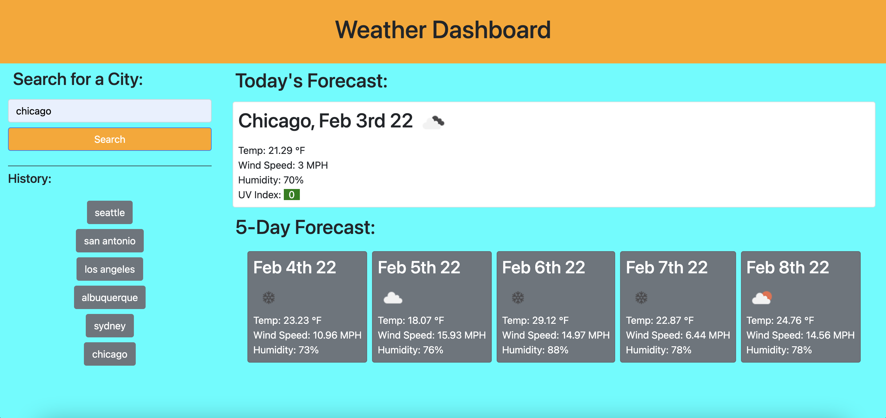

# hw6-weather-dashboard

## Description

This weather dashboard accepts user input of a city name and returns the current weather in that city, along with a 5-day forecast and a search history. When a user types a city name into the input bar, a card populated with the city name, current date, icon representing the weather, temp, wind speed, humidity, and UV index is displayed. The UV index is color coded to indicate the severity the value. Underneath this current weather card, a 5-day forecast is displayed with each day receiving a card showing the date, icon representing the weather, temp, wind speed, and humidity. When a user searches a city name, it is added to the search history, and a user can click on the city in the search history to re-search that city. When a user inputs data that is not recognized as a city, an error is console logged.

## Screenshot

## Links to Application

-   Here is the repo: [RedComet6/hw6](https://github.com/RedComet6/hw6-weather-dashboard)
-   Here is the pages: [RedComet6 hw6 Pages](https://redcomet6.github.io/hw6-weather-dashboard/)
